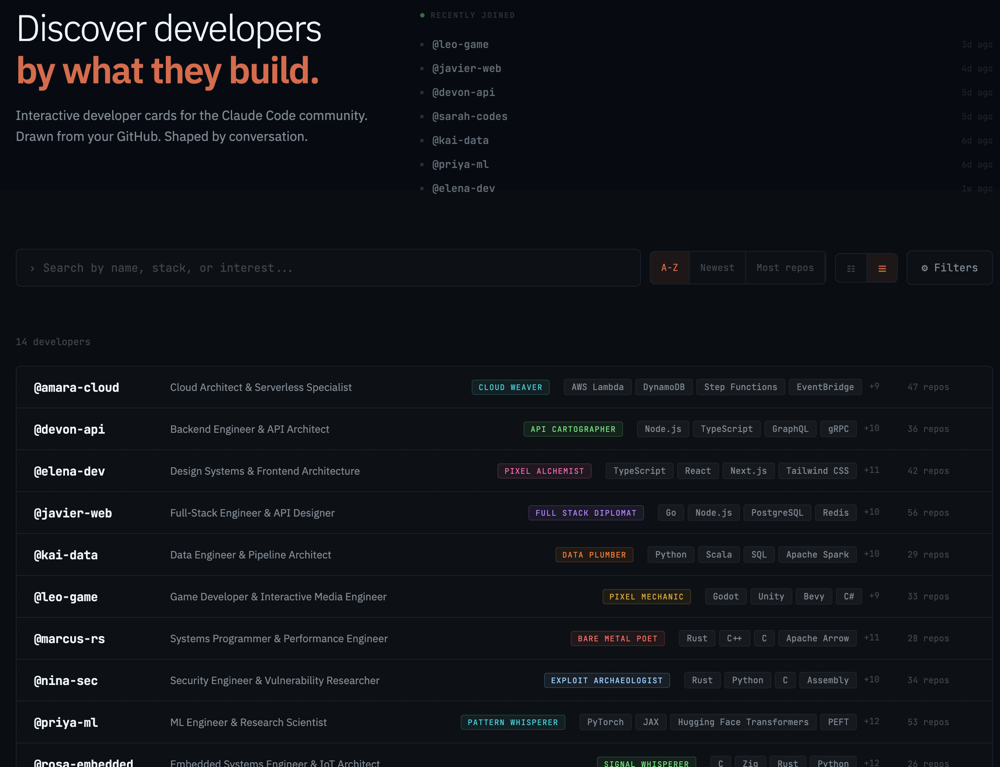

# devcard registry

The community gallery for [devcard](https://github.com/devcard-community/devcard) - developer identity cards built with Claude Code.

**[Browse the gallery](https://devcard-community.github.io/registry/)**



## How it works

1. Create your card with the devcard plugin: `/devcard:init`
2. Publish it: `/devcard:publish`
3. Your card gets a public page with an SVG card, social preview image, and share buttons

Each card lives as a YAML file in [`cards/`](cards/). When you submit a PR, CI validates the card and auto-merges it. A build pipeline generates static HTML pages, SVG cards, and OG images, then deploys to GitHub Pages.

## Card pages

Every published card gets:

- **HTML page** - `/cards/{username}/` with full card rendering, share buttons, and OG meta tags
- **SVG card** - `/cards/{username}/card.svg` for embedding in READMEs or websites
- **OG image** - `/cards/{username}/og.png` for social media previews

## Publishing your card

From Claude Code with the [devcard plugin](https://github.com/devcard-community/devcard) installed:

```
/devcard:publish
```

This forks the registry, adds your card YAML, and opens a PR. The CI workflow validates the card schema and auto-merges valid submissions.

## Viewing someone's card

```
/devcard:view @username
```

## Architecture

```
devcard-registry/
├── cards/                    # Published card YAML files (@username.yaml)
├── src/                      # React gallery app
│   ├── Gallery.jsx           # Card grid with search and filtering
│   ├── CardPage.jsx          # Individual card renderer
│   └── ...
├── site/                     # Static site generator
│   ├── build.mjs             # Generates HTML pages, SVGs, OG images
│   ├── validate.mjs          # Card schema validator
│   └── lib/
│       ├── generate-html.mjs # Static HTML card page generator
│       └── generate-svg.mjs  # SVG card generator
├── .github/workflows/
│   ├── validate-pr.yml       # PR validation + auto-merge
│   └── build-pages.yml       # Build + deploy to GitHub Pages
└── docs/                     # Generated output (deployed to Pages)
```
